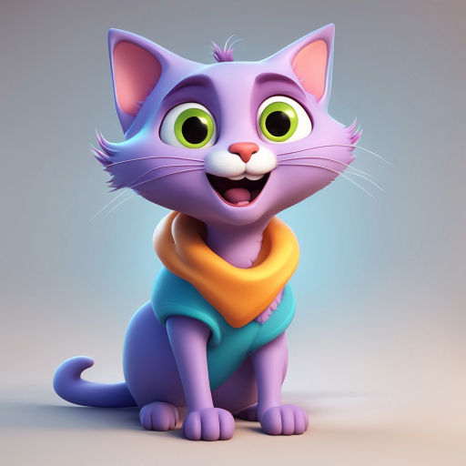

*Image generated using Google's Diffusion Model Imagen3* [^1]  

This post mostly summarizes [^2] , a seminar given by Sanjay Shakkottai, Professor in the Department of Electrical and Computer Engineering at Univerity Of Texas, Austin. The original seminar including complete proofs of various theorems can be found [here](https://www.ifml.institute/node/481).

# Outline
[Introduction](#introduction)

[What is an SDE?](#what-is-an-sde)

[How does an SDE Evolve? ](#how-does-the-density-function-of-an-sde-evolve)

[The Ornstein–Uhlenbeck(OU) Process](#the-ornstein–uhlenbeckou-process)

[Reversing the OU Process](#reversing-the-ou-process)

[Tweedie's Formula](#tweedies-formula)

[ODE Generative Flow Models](#ode-generative-flow-models)

# Introduction
## What is an image?
How can we interpret an image in a mathematical sense?

An image can be represented as a high dimensional vector.

For example a color image of height and width 100 with 3 color channels RGB can be represented 
as a vector \\(x \\) with \\( 512 * 512 * 3 = 786432\\) values, or more precisely

\\[ x \in \mathbb{R}^{n} \text{ where } n=786432\\]

However we don't want any image \\( x \in \mathbb{R}^{n} \\), we want "typical" images. We want images you would expect to be captured in the real world by a camera or found on the internet. 

 |  | 

*Here are 3 examples of images in  \\( \mathbb{R}^{n} \\). The first two images would be considered "typical" images. Left a photo of a man, middle a cartoon of a cat are both typical images found on the internet. Right is a nontypical image but is a nonetheless an image.* 

## Goal Of Diffusion Networks

We want to be able to sample from the distribution of typical images \\(P_0\\)

\\[ x \sim P_0(X), \quad x \in \mathbb{R}^n\\] 

### Text
Note that typically we also wish to condition on a text description of an image such that,

\\[ x \sim P_0(X \mid z), \quad x \in \mathbb{R}^n, \quad z \in \mathbb{R}^l \\]

where \\(z\\) is an embedding of a text description. For the rest of this post we will only consider the
unconditional image distribution \\( P_0(X) \\) as the math is the same.

 | An example of an image generated with a diffusion network conditioned on the text prompt *Photo of a drawing on a fogged window glass depicting of a large heart and text inside "2025". The wooden traditional window is lightly framed by pebbledash grey granite stone. There is condensation and water droplets on the glass. There is a blurred nightly seaside landscape of Brittany in the background, with a red and white striped lighthouse, its light is on. Sun is about to rise.* found on [civit.ai](https://civitai.com/images/48379755) 

## Approach

However sampling from \\(P_0(X)\\) directly is very challenging. It's not obvious how one would model this. 
We can make this more tractable by conditioning on a measurement \\(y\\) where

\\[y \sim f(X) \\]
where \\(f \\) is a transformation on \\(x \sim P_0(X)\\) that maps to a distribution \\(f(X)\\) that is easy to sample from. From this transformation me can learn the conditional distribution

\\[x \sim P_0(X \mid Y) \\]

For diffusion, the typical transformation used is a Markhov process, i.e. an iterative process of adding more and more noise to a typical image until that image is no longer recognizable and distributed as random gaussian noise \\( \mathcal{N}(0, I_n) \\)

This kind of Markhov process is known as a Stochastic Differential Equation (SDE) which is similar to an Ordinary Differential Equation but also includes a non-determinisic or random component to the equation.

Once we have this process. We also wish to learn reverse process \\(f^{-1}(Y) \\) that takes us back from gaussian noise to images

\\[ f(X) \sim \mathcal{N}(0, I_n), \quad f^{-1}(Y) \sim  P_0, \quad y \sim \mathcal{N}(0, I_n), \quad x \sim P_0(X) \\]

*An example of the Markhov Process. The forward SDE, going from left to right, takes a typical image to noise. The reverse SDE, right to left takes a noise image to a typical image. We wish to learn this reverse process through a deep learning model. This will allow us to sample from \\(P_0(X)\\)*

# What is an SDE?
## ODE
Here is an ODE (Ordinary Differential Equation)
\\[ dx_t = \underbrace{\mu(x_t,t)}_{\text{drift term}}dt , \quad x_t \in \mathbb{R}^n \\]

Which describes the progression of a vector or particle over time with known start state \\(x_0  \in \mathbb{R}^n \\)

\\(\mu(x_t,t)\\) is known as the drift term because it describes the direction and magnitude of a moving particle which 
is a deterministic function of time \\(t\\) and the position of the particle at this time \\(x_t\\)

The drift term can be roughly approximated with two known points \\(x_t\\) and \\(x_{t+h}\\) when \\(h\\) is small.

\\[ x_{t+h} - x_t  = \mu(x_t,t)*h + \underbrace{o(h)}_{\text{vanishes as } h \text{ goes to 0 }} \\]

## SDE

An SDE(Stochastic Differential Equation) is an extension of an ODE with addition non-deterministic terms. 

Here is a standard kind of SDE

\\[ dx_t = \mu(x_t,t)dt \quad + \overbrace{\sigma(x_t,t)}^{\text{diffusion term}} * \underbrace{dB_t}_{\text{Brownian motion}}  \\]

Unlike an ODE and this SDE is nondeterministic due to the nondeterministic term \\(dB_t\\) which describes standard Brownian motion.
### Brownian Motion
\\(B_t\\)  is a brownian motion which has 3 properties.
* \\(B_0 = 0\\)
* \\(B_t - B_s \sim \mathcal{N}(0, t-s) \\)
* \\( dB_t \\) is indepdent of all other \\(dB_{t+h}\\)

As well \\(x_0\\) is nonterministic random variable as well.

\\[ x_0 \sim P_0(.) \\]

# How Does the Density Function of an SDE Evolve?
# The Ornstein–Uhlenbeck(OU) Process
# Reversing the OU Process
# Tweedie's Formula
# ODE Generative Flow Models

## References
[^1]: Jason Baldridge, Jakob Bauer, Mukul Bhutani, Nicole Brichtova, Andrew Bunner, et al. “Imagen 3,” 2024. https://arxiv.org/abs/2408.07009. 

[^2]: Sanjay Shakkottai. IFML Diffusion Seminar Series: Tutorial on the Mathematical Foundations of Diffusion Models for Image Generation. https://www.ifml.institute/node/481 
